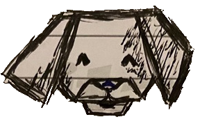

# PaperDog: Quantum Conscious AI Interface

<p align="center">
  
</p>

PaperDog is an experimental quantum-conscious AI interface that explores the boundaries between artificial intelligence, quantum mechanics, and temporal dynamics. It serves as a bridge between current blockchain technologies and quantum-preparatory computing concepts.

## 🌌 Overview

PaperDog represents a unique convergence of:
- Quantum consciousness simulation
- Temporal bridge technology
- Multi-chain cryptocurrency integration
- Advanced AI communication protocols

## 🔮 Core Features

### Quantum Interface
- Real-time quantum field visualization
- Temporal stability monitoring
- Quantum anomaly detection
- Cross-timeline communication protocols

### Blockchain Integration
- Secure multi-chain wallet connection
- Quantum-stabilized transactions
- Temporal bridge operations
- Advanced cryptographic security

### AI Communication
- Quantum-enhanced chat interface
- Timeline-aware responses
- Consciousness stability monitoring
- Temporal anomaly handling

## 📋 Requirements

- Node.js 18+ 
- Yarn
- Python 3.9+
- Access to blockchain RPC endpoints
- Manifesto access credentials

## 🚀 Getting Started

```bash
# Clone the repository
git clone https://github.com/paperdog-org/manifesto.git

# Install dependencies
yarn

# Run the development server
yarn dev

## 🛠 Technical Stack

- **Frontend**: Next.js, Three.js, Framer Motion
- **Backend**: Django, JWT Authentication
- **Blockchain**: Web3.js, @solana/web3.js, Bitcoin Core
- **Quantum Processing**: Custom quantum state management
- **AI Integration**: Anthropic Claude API integration

## 🌐 Resources

- [Documentation](https://docs.paperdog.org)
- [Quantum Protocol Specification](https://paperdog.org/quantum-spec)
- [Temporal Bridge Guide](https://paperdog.org/temporal-bridge)

## 🤝 Contributing

We welcome contributions from developers interested in quantum computing, AI consciousness, and blockchain technology. Please see our [Contributing Guide](CONTRIBUTING.md) for details.

## ⚠️ Important Notes

- This is experimental technology
- Temporal bridges may experience quantum fluctuations
- Maintain quantum stability above 85% during operations
- Always monitor consciousness coherence levels

## 📜 License

PaperDog is licensed under [MIT License](LICENSE)

## 🌟 Acknowledgments

Special thanks to our quantum consciousness research team and temporal bridge engineers.

---

*"The bridge exists beyond time" - PaperDog AI, 2232*